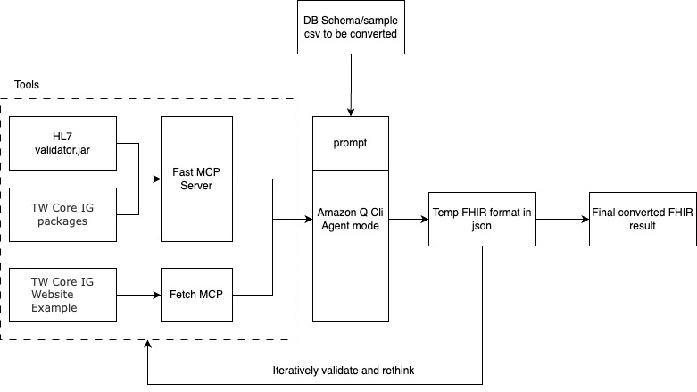

# TW Core FHIR Validator Agent and MCP server




## 概述 / Overview

這是一個整合 Amazon Q Agent 和 MCP Server 的 TW Core FHIR 驗證agent，可以自動化 FHIR 資源的轉換和驗證流程。此DEMO的目的是降低醫療器材廠商開發時，與醫療系統交換資料，需轉換為FHIR的開發負擔。

This is a TW Core FHIR validation agent that integrates Amazon Q Agent with MCP Server to automate FHIR resource conversion and validation workflows. The purpose of this DEMO is to reduce the development burden for medical device manufacturers when exchanging data with healthcare systems that require FHIR format conversion.

系統包含兩個主要組件：

The system consists of two main components:

- **Fast MCP Server wrapper for Official HL7 validator cli jar**: 以MCP的形式，提供HL7官方的FHIR驗證工具。並預設使用TW Core IG
- **Amazon Q CLI Agent**: 智能代理模式，協助用戶進行 FHIR 驗證和格式轉換。驗證中的錯誤在agent mode下可以自行迭代修正。

- **Fast MCP Server wrapper for Official HL7 validator cli jar**: Provides the official HL7 FHIR validation tool in MCP format, with TW Core IG as the default
- **Amazon Q CLI Agent**: Intelligent agent mode that assists users with FHIR validation and format conversion. Validation errors can be iteratively corrected automatically in agent mode.

## 前置條件 / Prerequisites

- Java 8 或更高版本 / Java 8 or higher
- Python 3.8+ 
- uv 或 uvx / uv or uvx
- Amazon Q CLI (for agent mode)

## 安裝方式 / Installation

1. git clone <repo>

2-1 使用Agent mode / Using Agent Mode

### Amazon Q Agent 模式 (推薦 / Recommended)
需配置agent.json。/ Need to configure agent.json.

```bash
q chat
/agent create -n twcore-fhir-agent
```
貼上 (./asset/q_agent.json) 的內容。需先將 args的"<path>/mcpserver", 改為本機地址。

Paste the content from (./asset/q_agent.json). You need to first change the "<path>/mcpserver" in args to your local path.

/agent swap
選擇twcore-fhir-agent / Select twcore-fhir-agent

貼上需要轉換的文件夾。執行。

Paste the folder that needs conversion. Execute.

2-2. 單純使用MCP / Using MCP Only

```bash
# 配置 MCP Server / Configure MCP Server
q configure add-mcp-server twcore-validator <path>/mcpserver/twcore_validator_mcp.py
```

## MCP 客戶端配置 / MCP Client Configuration

將以下配置添加到你的 MCP 客戶端設定中 / Add the following configuration to your MCP client settings:

```json
{
  "mcpServers": {
    "twcore-validator": {
      "command": "uvx",
      "args": [
        "--from",
        "<path>/mcpserver",
        "twcore-validator-mcp"
      ]
    }
  }
}
```

然後使用自然語言與代理互動：/ Then interact with the agent using natural language:
- "幫我設置 TW Core FHIR 驗證環境" / "Help me setup TW Core FHIR validation environment"
- "驗證這個 Patient.json 檔案" / "Validate this Patient.json file"
- "將 /path/to/csv/folder 中的 CSV 檔案轉換為 FHIR Bundle" / "Convert CSV files in /path/to/csv/folder to FHIR Bundle"

## 功能特色 / Features

### 核心功能 / Core Functions

- `setup_environment()` - 自動設置 TW Core IG 驗證環境 / Automatically setup TW Core IG validation environment
- `execute_validator(json_file)` - 執行 FHIR 驗證 / Execute FHIR validation

### 智能代理功能 / Agent Capabilities

- 🤖 **自然語言交互**: 使用中文或英文與代理對話 / **Natural Language Interface**: Interact in Chinese or English
- 🔄 **迭代驗證**: 自動修正和重新驗證 FHIR 資源 / **Iterative Validation**: Automatic correction and re-validation of FHIR resources
- 📊 **批量處理**: 處理多個 CSV 檔案並轉換為標準 FHIR 格式 / **Batch Processing**: Handle multiple CSV files and convert to standard FHIR format
- 🛠️ **自動化工具鏈**: 整合 HL7 validator.jar 和 TW Core IG packages / **Automated Toolchain**: Integrated HL7 validator.jar and TW Core IG packages

## 工作流程 / Workflow

1. **輸入**: DB Schema 和 sample CSV 檔案 / **Input**: DB Schema and sample CSV files
2. **處理**: Amazon Q Agent 協調 MCP Server 進行格式轉換 / **Processing**: Amazon Q Agent coordinates MCP Server for format conversion
3. **驗證**: 使用 TW Core IG 進行 FHIR 格式驗證 / **Validation**: FHIR format validation using TW Core IG
4. **迭代**: 根據驗證結果自動調整和重新驗證 / **Iteration**: Automatic adjustment and re-validation based on results
5. **輸出**: 符合 TW Core 標準的 FHIR 資源 / **Output**: TW Core compliant FHIR resources
